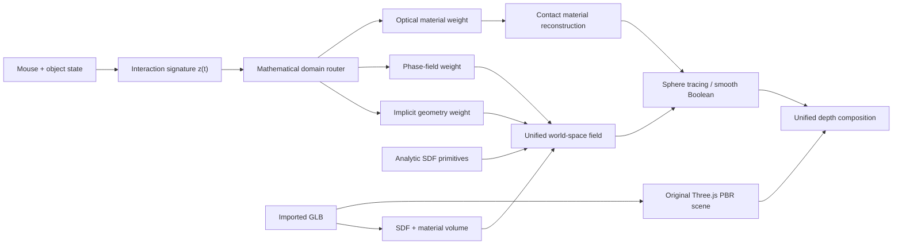

<div align="center">

# MeltMesh

**A browser sandbox that infers the mathematical model from the interaction.**

Import real GLB assets, move them into contact, and render geometry dissolution,
material transfer, refraction, and contact memory in one depth-aware scene.

[](LICENSE)


[Quick Start](#quick-start) · [Mathematical Router](#mathematical-domain-router) ·
[Architecture](#architecture) · [Limits](#current-limits) · [中文](#中文简介)

</div>

MeltMesh explores a specific question:

> Can a modeling tool detect what kind of mathematical problem an interaction
> has become, then switch its solver emphasis while the user is still moving
> the objects?

The current prototype combines imported mesh volumes, analytic signed distance
fields, directional Boolean contact, surface phase memory, and refractive
material sampling. It supports up to five imported GLB assets and keeps each
asset independently selectable and transformable.

The visual reference is the continuous, soft contact language popularized by
tools such as Womp. The implementation is independent and does not use Womp
source code or proprietary assets.

## What Works

- Import up to five GLB/GLTF assets without replacing earlier imports.
- Preserve original Three.js PBR meshes, textures, animation clips, and material
  response in the rasterized scene.
- Convert imported assets into world-space SDF and material volumes.
- Combine analytic primitives and imported volumes with smooth directional
  Boolean operations.
- Record contact seeds and evolve a persistent, surface-local dissolution field.
- Mix material samples from the source objects inside the generated contact
  surface instead of assigning an empty material.
- Route each frame between implicit geometry, phase-field evolution, and optical
  material response using the live interaction state.
- Render imported PBR geometry and generated SDF surfaces through one depth
  pipeline.
- Use Three.js as the primary renderer, with WebGL2 fallback and an experimental
  WebGPU path.

## Mathematical Domain Router

The router turns raw interaction state into a compact problem signature:

\[
z_t =
\left[
p_t,\ d_t,\ v_t,\ \tau_t,\ c_t,\ n_t
\right]
\]

where:

- \(p_t\): proximity between objects
- \(d_t\): estimated penetration
- \(v_t\): maximum relative motion
- \(\tau_t\): accumulated contact duration
- \(c_t\): material contrast
- \(n_t\): active object count

Three expert scores are evaluated:

\[
s_t =
\begin{bmatrix}
s_{\mathrm{SDF}}(z_t) \\
s_{\mathrm{phase}}(z_t) \\
s_{\mathrm{optical}}(z_t)
\end{bmatrix},
\qquad
\pi_t = \operatorname{softmax}(s_t)
\]

The weights \(\pi_t\) continuously modify the effective solver:

\[
\theta_t =
\pi_{\mathrm{SDF}}\theta_{\mathrm{geometry}}
+ \pi_{\mathrm{phase}}\theta_{\mathrm{dissolution}}
+ \pi_{\mathrm{optical}}\theta_{\mathrm{material}}
\]

In the current implementation:

- implicit geometry increases smooth-union influence near contact;
- phase-field weight expands the consumption front and its local variation;
- optical weight increases transmission and refractive ownership at material
  boundaries.

The inspector displays the three weights and the current interaction signature,
so the routing decision is observable while objects move.

This router is deliberately a deterministic heuristic, not a trained AI model.
Its interface is designed so that a learned classifier or policy can replace
the score functions later without changing the render pipeline.

## Contact Model

For primitive field \(A\) and imported field \(B\), the directional contact
surface starts from:

\[
C(A,B) =
\operatorname{smin}_{k}
\left(
\max(A,-B_{\mathrm{front}}),
B
\right)
\]

The imported front is modified by persistent contact memory \(\phi\):

\[
B_{\mathrm{front}}(x,t)
= B(x)
- r_c \phi(x,t)
+ \eta(x)\,a_n\phi(x,t)
\]

The material at a generated point is not a fixed color. It is reconstructed
from source material fields:

\[
M(x) =
\frac{\sum_i w_i(x)M_i(x)}
{\sum_i w_i(x)+\varepsilon}
\]

where the weights depend on distance, contact ownership, phase memory, and the
router's optical-domain weight. The result is a spatially varying contact
material rather than a uniform overlay.

More detail is available in:

- [MATHEMATICAL_MODEL.md](MATHEMATICAL_MODEL.md)
- [MODEL_SPECIFICATION.md](MODEL_SPECIFICATION.md)
- [REFRACTION_MODEL.md](REFRACTION_MODEL.md)

## Architecture



## Quick Start

Requirements:

- Python 3.10+
- Blender 4.x or newer for GLB volume conversion
- A Chromium-based browser with hardware acceleration

Run the local server:

```bash
git clone <repository-url>
cd meltmesh
python server.py
```

Open `http://127.0.0.1:4173/`.

Use **Import** or drag GLB files into the viewport. Select an object in the
scene list, move it with the mouse, and bring it into contact with another
object. The right inspector shows which mathematical domain currently controls
the response.

## Project Structure

```text
index.html              Workbench UI
styles.css              Compact editor visual system
app.js                  State, WebGL2 fallback, import and unified volumes
three-renderer.js       Primary Three.js PBR and SDF renderer
webgpu-renderer.js      Experimental WebGPU path
domain-router.js        Live problem signature and solver routing
convert_glb.py          Blender GLB to SDF/material-volume conversion
server.py               Local server and conversion endpoint
MATHEMATICAL_MODEL.md   Core mathematical framing
MODEL_SPECIFICATION.md  Solver and implementation specification
REFRACTION_MODEL.md     Contact reflection and material transfer model
```

## Current Limits

This is a research prototype, not a production solid modeler.

- Imported SDF resolution is currently fixed at \(64^3\); thin frames and mesh
  screens can lose detail or become inflated.
- The live router estimates contact with scaled bounding proxies. The actual SDF
  still controls rendering, but routing weights are not yet derived from exact
  surface integrals.
- CPU rebuilding of the unified imported volume becomes expensive as asset count
  and resolution increase.
- GLB material baking approximates complex node graphs. Procedural Blender
  shaders must be baked to textures first.
- WebGPU is experimental. Three.js/WebGL2 remains the reliable path.
- Transparent surfaces use screen-space refraction and cannot reconstruct
  geometry that is fully hidden outside the rendered scene buffers.

## Roadmap

- Replace proxy contact measurements with GPU reductions over exact SDF overlap.
- Move multi-volume composition and material baking to WebGPU compute.
- Add sparse bricks or clipmaps for thin, high-detail imported assets.
- Fit router score functions from interaction traces and visual-quality metrics.
- Add reaction-diffusion material transport across the contact membrane.
- Export the fused result through adaptive Dual Contouring.
- Add deterministic scene files for reproducible experiments and benchmarks.

## Contributing

Useful contributions include:

- SDF conversion quality for thin or open meshes
- stable material-volume interpolation
- exact contact metrics
- WebGPU compute kernels
- visual regression scenes
- performance traces from integrated GPUs

Please keep benchmark scenes and before/after screenshots with rendering
changes. Visual claims should be reproducible.

## License And Attribution

MeltMesh is licensed under the [MIT License](LICENSE). Third-party dependencies
and licenses are listed in [THIRD_PARTY_NOTICES.md](THIRD_PARTY_NOTICES.md).

The project uses established public techniques including signed distance
fields, sphere tracing, smooth CSG, phase fields, volume sampling, and PBR
rendering. It does not contain copied Womp implementation code.

## 中文简介

MeltMesh 是一个浏览器端实验性三维建模沙盘。它不只执行固定的平滑布尔，而是根据实时交互状态构造问题特征，动态分配三类数学模型的权重：

- 隐式几何：决定接触面的形状、融合范围和布尔连续性；
- 相场演化：决定溶解前沿、接触记忆和空间变化；
- 折射材质：决定交汇区域如何继承、混合和重构源物体材质。

当前版本支持最多五个 GLB 资产独立导入、选择和移动，并将原始 Three.js PBR 网格与生成式 SDF 表面放入同一深度管线。右侧面板会实时展示模型域权重和接触特征，便于观察系统为什么改变渲染策略。

现阶段的路由器是可解释的启发式模型，不是训练完成的 AI。项目下一阶段会把精确 SDF 接触积分、WebGPU 计算和可学习策略接入同一个接口。
