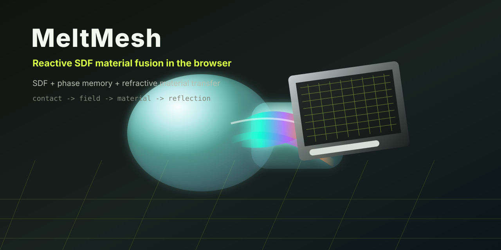
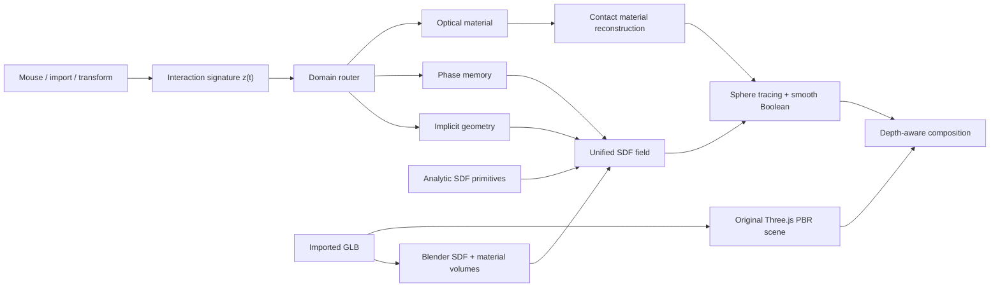

<div align="center">

# MeltMesh

### Reactive SDF material fusion in the browser



Import real GLB assets, push them into contact, and turn the overlap into a
live mathematical surface: smooth Boolean geometry, phase-field dissolution,
source-material transfer, and refractive reflection patterns in one
depth-aware scene.

[](LICENSE)


[Why](#why) · [Demo](#demo-workflow) · [Model](#core-model) ·
[Architecture](#architecture) · [Run](#run-locally)

Languages:
[English](README.md) ·
[简体中文](README.zh-CN.md) ·
[日本語](docs/i18n/README.ja.md) ·
[한국어](docs/i18n/README.ko.md) ·
[Español](docs/i18n/README.es.md) ·
[Français](docs/i18n/README.fr.md) ·
[Deutsch](docs/i18n/README.de.md) ·
[Português](docs/i18n/README.pt-BR.md)

</div>

## Why

Most browser 3D demos treat imported meshes and procedural SDF objects as
separate layers. The mesh renders with rasterized PBR. The SDF blob renders in a
shader. Contact is only a visual overlap.

MeltMesh explores a different interaction model:

> When two objects touch, the contact itself becomes a new computable material.

The project turns live interaction state into a compact mathematical problem
signature, then routes the response between three domains:

1. **Implicit geometry**: smooth Boolean fields and mesh-derived SDF volumes.
2. **Phase-field evolution**: persistent local contact memory and dissolution fronts.
3. **Optical material transfer**: refractive reflection patterns reconstructed from source materials.

## What works today

- Import up to **five GLB assets** without replacing earlier imports.
- Keep each imported asset independently selectable and transformable.
- Preserve original Three.js PBR meshes, textures, animations, and material response.
- Convert GLB geometry into a `64^3` SDF volume through Blender.
- Bake source color, roughness, metalness, alpha, emission, and transmission into material volumes.
- Fuse analytic SDF primitives with imported mesh SDFs.
- Generate contact memory seeds as objects collide and move.
- Render refractive contact bands driven by material contrast and phase memory.
- Compose imported PBR geometry and generated SDF surfaces through one depth-aware Three.js scene.
- Fall back to WebGL2; keep an experimental WebGPU path for future compute work.

## Demo workflow

1. Start the local server.
2. Open `http://127.0.0.1:4173/`.
3. Drag a `.glb` file into the viewport.
4. Select the imported object or one of the SDF primitives.
5. Move objects into contact.
6. Watch the contact region change from simple overlap into:
   - geometric smoothing,
   - local dissolution,
   - source-material transfer,
   - refractive reflection bands,
   - persistent contact memory.

## Core model

MeltMesh is built around a live interaction state:

```math
z_t =
\left[
p_t,\ d_t,\ v_t,\ \tau_t,\ c_t,\ n_t
\right]
```

where:

- `p_t` is object proximity,
- `d_t` is estimated penetration,
- `v_t` is relative motion,
- `tau_t` is accumulated contact time,
- `c_t` is material contrast,
- `n_t` is the active object count.

The router maps this state into domain weights:

```math
\pi_t =
\mathrm{softmax}
\begin{bmatrix}
s_{\mathrm{SDF}}(z_t) \\
s_{\mathrm{phase}}(z_t) \\
s_{\mathrm{optical}}(z_t)
\end{bmatrix}
```

Those weights modify the effective solver:

```math
\theta_t =
\pi_{\mathrm{SDF}}\theta_{\mathrm{geometry}}
+ \pi_{\mathrm{phase}}\theta_{\mathrm{dissolution}}
+ \pi_{\mathrm{optical}}\theta_{\mathrm{material}}
```

### Contact geometry

For an analytic primitive field `A(x)` and an imported mesh field `B(x)`, the
generated contact surface starts from a directional smooth Boolean:

```math
C(A,B) =
\mathrm{smin}_{k}
\left(
\max(A,-B_{\mathrm{front}}),
B
\right)
```

The imported front is moved by contact memory:

```math
B_{\mathrm{front}}(x,t)
= B(x)
- r_c\phi(x,t)
+ \eta(x)a_n\phi(x,t)
```

where `phi` is a persistent local phase field and `eta` is a structured noise
field that breaks the front into organic, non-uniform dissolution.

### Material reconstruction

The mixed surface is not assigned a blank material. It samples source material
fields and reconstructs a contact material:

```math
M(x) =
\frac{\sum_i w_i(x)M_i(x)}
{\sum_i w_i(x)+\varepsilon}
```

The weights depend on SDF ownership, contact memory, optical routing weight, and
material contrast.

### Reflection field

The reflection effect is modeled as a contact-local optical field:

```math
R(x,n,t) =
K(x,t)\ I(x)\ Q(x,n,t)\ F(n,v)
```

with:

- `K`: contact kernel,
- `I`: material impedance, derived from color, metalness, roughness, and transmission differences,
- `Q`: quasi-crystal spectral basis,
- `F`: Fresnel response.

This is why the contact band can show different colors and structures at
different points instead of becoming a uniform glow.

More detail:

- [MATHEMATICAL_MODEL.md](MATHEMATICAL_MODEL.md)
- [MODEL_SPECIFICATION.md](MODEL_SPECIFICATION.md)
- [REFRACTION_MODEL.md](REFRACTION_MODEL.md)

## Architecture



## Run locally

Requirements:

- Python 3.10+
- Blender 4.x or newer, available in `PATH`, or configured through `FIELD_STUDIO_BLENDER`
- Chromium-based browser with hardware acceleration

```bash
git clone https://github.com/hippoley/meltmesh.git
cd meltmesh
python server.py
```

Open:

```text
http://127.0.0.1:4173/
```

If Blender is not on `PATH`:

```bash
FIELD_STUDIO_BLENDER="/path/to/blender" python server.py
```

On Windows PowerShell:

```powershell
$env:FIELD_STUDIO_BLENDER="C:\Program Files\Blender Foundation\Blender 4.3\blender.exe"
python server.py
```

## Project structure

```text
index.html              Workbench UI
styles.css              Compact editor visual system
app.js                  State, WebGL2 fallback, import pipeline, unified volumes
three-renderer.js       Primary Three.js PBR + SDF renderer
webgpu-renderer.js      Experimental WebGPU path
domain-router.js        Live problem signature and solver routing
convert_glb.py          Blender GLB-to-SDF/material-volume conversion
server.py               Local server and conversion endpoint
MATHEMATICAL_MODEL.md   Core mathematical framing
MODEL_SPECIFICATION.md  Solver and implementation specification
REFRACTION_MODEL.md     Contact reflection and material transfer model
```

## Current limits

MeltMesh is a research prototype, not a production CAD kernel.

- Imported SDF resolution is fixed at `64^3`.
- Very thin screens, wires, and open meshes can lose detail during voxelization.
- Multi-import volume rebuilds still run on the CPU.
- Complex Blender procedural node graphs are approximated unless baked to textures.
- WebGPU is experimental; Three.js/WebGL2 is the reliable path.
- Screen-space refraction cannot reconstruct hidden geometry outside the rendered buffers.

## Roadmap

- GPU exact overlap metrics over imported SDF volumes.
- WebGPU compute for multi-volume composition.
- Sparse brick volumes for thin imported assets.
- Reaction-diffusion material transport across the contact membrane.
- Learned or fitted routing policies from interaction traces.
- Adaptive Dual Contouring export of fused surfaces.
- Reproducible benchmark scenes and visual regression tests.

## Originality and attribution

MeltMesh uses established public graphics techniques: signed distance fields,
sphere tracing, smooth CSG, phase fields, volume sampling, screen-space
refraction, and PBR rendering.

The project references Womp as a public visual benchmark for soft contact
modeling. It does **not** contain Womp source code, proprietary algorithms,
assets, trademarks, or copied implementation material.

Fidget by Matt Keeter was reviewed as a public inspiration in implicit modeling.
No Fidget source file or code fragment is bundled in this repository.

Third-party dependency notices are listed in
[THIRD_PARTY_NOTICES.md](THIRD_PARTY_NOTICES.md).

## Contributing

Good first contribution areas:

- better GLB-to-SDF conversion for thin and open meshes,
- material-volume interpolation,
- exact contact metrics,
- WebGPU compute kernels,
- visual regression scenes,
- performance traces from integrated GPUs,
- documentation examples with before/after screenshots.

Please keep visual claims reproducible. If a rendering change improves the
effect, include the scene, settings, and screenshot.
