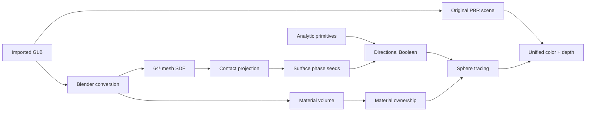

<div align="center">

# MeltMesh

### Make any GLB melt, merge, and react in your browser.

Real-time directional SDF booleans, surface-bound phase fields, and original PBR materials in one depth-aware renderer.

[](LICENSE)


[Quick start](#quick-start) · [How it works](#how-it-works) · [Detailed model](MODEL_SPECIFICATION.md) · [Refraction model](REFRACTION_MODEL.md) · [Roadmap](#roadmap) · [中文](#中文简介)

</div>

MeltMesh is an open-source browser experiment for **reactive 3D modeling**. Import a GLB, move analytic shapes into it, and watch the old geometry dissolve into the imported model through a directional Boolean and a stateful contact field.

This is not another triangle-mesh Boolean demo. The imported mesh, analytic SDF primitives, contact history, baked material volume, and original Three.js PBR scene are evaluated as parts of one interaction model.

Its research direction is the **Refractive Contact Field**: when objects touch, geometry and material traits do not merely blend. They reflect across the contact membrane, refract through material impedance, replicate with controlled mutation, and dissolve along a surface phase field. Read the [concept and equations](REFRACTION_MODEL.md).

For the full solver specification—including nondimensional parameters, reaction-diffusion recipes, stability constraints, GPU data structures, and calibration targets—read [MODEL_SPECIFICATION.md](MODEL_SPECIFICATION.md).

> **Status:** research prototype. The interaction model works, but thin meshes are still limited by the current `64³` imported SDF. See [Known limits](#known-limits).

## Why MeltMesh?

Most real-time SDF demos stop at symmetric smooth union:

```text
smoothMin(shapeA, shapeB)
```

That makes two shapes look glued together, but it cannot express **who consumes whom**, where the contact happened, or which material owns the new surface.

MeltMesh models a directional process:

```text
existing geometry A  ──dissolves into──▶  imported model B
```

- **Directional absorption** instead of symmetric blobs.
- **Contact memory** instead of an effect that resets every frame.
- **Surface-bound phase seeds** instead of a global dissolve slider.
- **Material ownership** instead of painting one color over the result.
- **Unified depth** instead of stacking unrelated WebGL canvases.

## Features

- Import animated GLB scenes and retain original Three.js PBR materials.
- Bake imported meshes into an SDF and a sampled material volume with Blender.
- Move and scale spheres, rounded boxes, and imported objects with the mouse.
- Erode existing primitives into imported geometry with an `A -> B` Boolean solver.
- Accumulate multiple independent dissolve traces at measured contact positions.
- Project contact samples onto the imported surface using the SDF gradient.
- Spread dissolution along the surface with anisotropic phase fields.
- Preserve contact history, or let it recover at a tunable rate.
- Render the original GLB and generated SDF surfaces through one depth pipeline.
- Use an experimental WebGPU path with a WebGL2 fallback.
- Tune contact, erosion, smoothing, noise, dissolve rate, and recovery live.

## Quick start

### Requirements

- Python 3.10+
- Blender 4.x or 5.x
- A modern WebGL2 browser; Chromium/Chrome is recommended
- Hardware acceleration enabled

No npm install. No bundler. No frontend build step.

### Run

```bash
git clone <your-repository-url>
cd meltmesh
python server.py
```

Open [http://127.0.0.1:4173/](http://127.0.0.1:4173/).

If Blender is not on `PATH`, point MeltMesh to the executable:

```powershell
$env:FIELD_STUDIO_BLENDER = "C:\Program Files\Blender Foundation\Blender 5.2\blender.exe"
python server.py
```

```bash
export FIELD_STUDIO_BLENDER=/path/to/blender
python server.py
```

Click **Import**, choose a `.glb`, wait for the SDF bake, then move a sphere or rounded box into the imported model. Keep the objects in contact to accumulate the local phase field.

## How it works



Let `A` be the existing analytic geometry and `B` the imported mesh. MeltMesh builds a phase-controlled consuming field around `B`:

```text
dC      = dB - erosionRadius(phase) + frontNoise
erodedA = max(dA, -dC)
result  = adaptiveSmoothMin(erodedA, dB)
```

Each measured contact creates an anisotropic phase seed:

```text
phase = 1 - product(1 - seedContribution)
```

The field spreads farther along the mesh tangent plane than along its normal, reducing accidental bleed through thin surfaces. The full derivation, equations, parameter mapping, and acceptance criteria are in [MATHEMATICAL_MODEL.md](MATHEMATICAL_MODEL.md).

## Boolean solver controls

| Control | What it changes | If the result looks wrong |
|---|---|---|
| Blend strength | Global interaction scale | Lower it when objects inflate |
| Contact threshold | Distance that starts phase accumulation | Lower it when objects react in mid-air |
| Erosion radius | How deeply `B` consumes `A` | Raise it when dissolution is too weak |
| Boolean smoothing | Width of the final connection | Lower it when the joint looks swollen |
| Front noise | Irregularity of the erosion boundary | Raise it when the cut looks mechanical |
| Dissolve rate | Phase growth while touching | Raise it for faster feedback |
| Recovery rate | Phase decay after separation | Set it to `0` to retain traces |

Suggested baseline:

```text
Blend strength     0.28
Contact threshold  0.22
Erosion radius     1.05
Boolean smoothing  0.14
Front noise        0.18
Dissolve rate      0.85
Recovery rate      0.01
```

## GLB conversion pipeline

The local server invokes Blender to:

1. sanitize incompatible GLB extension values;
2. evaluate meshes and animation frames;
3. generate an STL animation cache;
4. sample a signed or shell distance volume;
5. bake base color and roughness into a material volume; and
6. write disposable artifacts to `cache/`.

The upload limit is 500 MB and the conversion timeout is five minutes.

## Project layout

```text
meltmesh/
├── app.js                     WebGL2 SDF, state, and interaction
├── three-renderer.js          Three.js PBR and unified depth composite
├── webgpu-renderer.js         Experimental WebGPU path
├── convert_glb.py             Blender mesh/SDF/material conversion
├── server.py                  Local server and conversion API
├── index.html                 Application interface
├── styles.css                 Interface styling
├── MATHEMATICAL_MODEL.md      Full mathematical model
├── REFRACTION_MODEL.md        Reflection/replication research model
├── MODEL_SPECIFICATION.md     Detailed solver and numerical specification
├── THIRD_PARTY_NOTICES.md     Dependency attribution
└── vendor/three/              Three.js r147 and its license
```

## Known limits

- The fixed `64³` SDF cannot preserve every wire, thin wall, or sharp metal edge.
- Eight analytic phase seeds approximate a local field; this is not a full 3D PDE grid.
- The baked material volume currently focuses on base color and roughness.
- The conversion endpoint currently accepts GLB only.
- Blender conversion is synchronous, so large assets block the import workflow.
- Automated GPU screenshot and performance regression tests are not in place yet.

## Roadmap

- [ ] Local `128³` or adaptive sparse narrow-band SDF
- [ ] GPU ping-pong 3D phase-field evolution
- [ ] Full PBR volume: metalness, normals, transmission, and emission
- [ ] Screen-error-aware adaptive sphere tracing
- [ ] OBJ, FBX, USD, and USDZ conversion
- [ ] Undoable object and Boolean operation history
- [ ] Reproducible desktop/mobile visual regression tests
- [ ] Shareable scene files and hosted demos

## Contributing

Issues and pull requests are welcome.

1. Do not commit `cache/`, logs, or imported user models.
2. Test shader changes both with and without an imported model.
3. Include browser, GPU, Blender version, and reproduction steps in bug reports.
4. Do not submit code or assets with unknown or incompatible licensing.
5. Preserve third-party licenses and update `THIRD_PARTY_NOTICES.md` when needed.

High-impact contribution areas are adaptive SDF generation, phase-field compute, PBR volume baking, GPU profiling, and visual regression infrastructure.

## 中文简介

MeltMesh 是一个浏览器实时隐式建模实验项目。它允许导入 GLB，保留原始 PBR 材质，并让球体、圆角盒等现有几何通过定向布尔和局部相场逐渐溶解进导入模型。

项目当前重点不是复刻某个商业工具，而是探索一套可解释、可调节、可开源的连续几何交互模型。中文数学说明见 [MATHEMATICAL_MODEL.md](MATHEMATICAL_MODEL.md)。

## License

MeltMesh is released under the [MIT License](LICENSE).

Bundled Three.js files remain under their original MIT license. See [THIRD_PARTY_NOTICES.md](THIRD_PARTY_NOTICES.md) and [vendor/three/LICENSE](vendor/three/LICENSE).

## Attribution and independence

- [Three.js](https://github.com/mrdoob/three.js) provides the PBR, GLB loading, and WebGL foundation.
- Khronos glTF specifications define the interoperable GLB and material formats.
- SDFs, smooth CSG, sphere tracing, finite differences, and phase fields are established public mathematical and graphics techniques.
- Womp is a visual interaction benchmark only. MeltMesh contains no Womp source code or proprietary assets and is not affiliated with Womp.
- Matt Keeter's Fidget is acknowledged as public technical inspiration for implicit modeling. No Fidget source fragment is bundled here.
